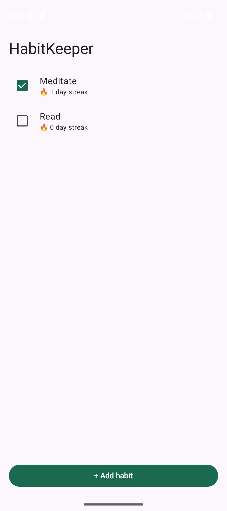
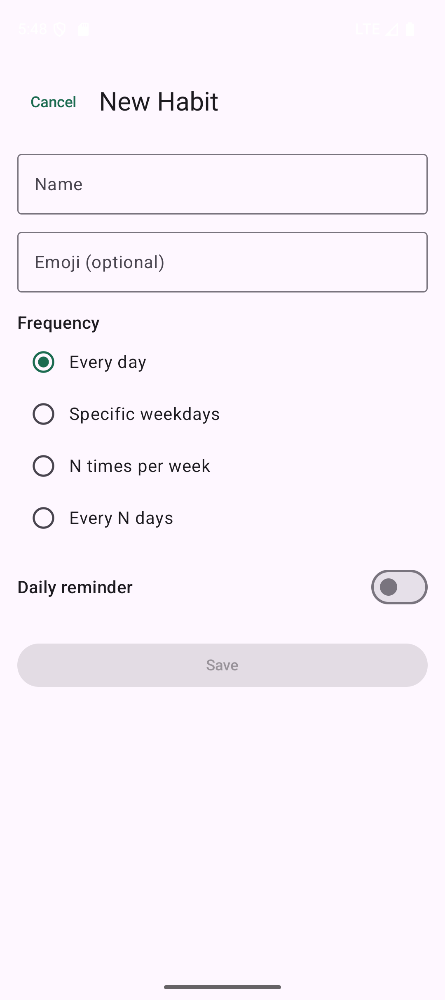

# HabitKeeper

> A local-first habit tracker that does the five things competitors get yelled at for.
> 一个本地优先的习惯打卡 app —— 把竞品被骂最多的五件事做对。

**No subscription. No account. No data loss. No ads. Your data never leaves your phone.**

## Why / 为什么做这个

This isn't a guess at what users want — every feature traces back to a real 1–2 star
review. The market research was done with [play-pain-miner](https://github.com/94xhn/play-pain-miner):
120 negative reviews across the top habit-tracker apps (HabitNow, Loop Habit Tracker,
HabitKit) were mined and classified. The product is literally **competitor core features
minus their most-complained-about pain points**.

本项目不靠拍脑袋猜需求：每个功能都能追溯到一条真实的 1–2 星差评。市场调研由
[play-pain-miner](https://github.com/94xhn/play-pain-miner) 完成——抓取并分类了头部习惯
打卡 app（HabitNow / Loop / HabitKit）的 120 条差评。产品 = **竞品核心功能 − 高频痛点**。

## What we fix / 差评 → 卖点

| Competitor pain (review weight) | What HabitKeeper does |
|---|---|
| "Functionality missing" `333` — daily-only, no flexible schedules | **Flexible frequency**: daily / specific weekdays / N-times-per-week / every-N-days |
| "Subscription / paywall" `71` — stats, widgets, 5th habit locked | **Everything free** — no paywall on core features |
| "Data loss" `45` — "switched phones, lost a year of data" | **Local-first** + auto-backup; optional export to *your own* cloud |
| "Privacy / permissions" `106` | **Zero permissions — not even INTERNET** |
| "Hard to use" `56` | Simple list, habit grouping, drag-to-reorder (roadmap) |

## Screenshots / 截图

| Home · streaks | Add / edit habit |
|---|---|
|  |  |

## Business model / 商业模式

**Free & open-source, local-first — not SaaS.** No backend, no servers, no logins, no ads,
no in-app purchases. This is a deliberate choice driven by the review data: subscriptions,
cloud-sync failures, and forced accounts are exactly what users complain about. Optional
backup rides on the user's own cloud (Drive / Dropbox / WebDAV) so there's nothing to shut down.

**完全免费 + 开源 + 本地优先,不是 SaaS。** 无后端、无服务器、无登录、无广告、无内购。这是差评数据决定的策略选择。

## Architecture / 架构

```
domain/   pure Kotlin — Frequency, Schedule (is-due engine), Streak math. No Android. Unit-tested.
data/     Room (entities + DAOs) + HabitRepository (owns Frequency<->columns mapping).
di/       AppContainer — tiny manual DI, no framework.
ui/       Compose + ViewModel (MVVM).
```

The `domain` layer is the heart and is fully covered by JVM unit tests (no emulator needed).

## Build / 构建

Requires Android Studio (bundled JDK 17+) and an Android SDK.

```bash
# Run the pure-logic unit tests (no device/emulator needed)
./gradlew testDebugUnitTest

# Build a debug APK
./gradlew assembleDebug
```

Or just open the project in Android Studio and Run.

- minSdk 26 · targetSdk 35 · Kotlin 2.0 · Compose · Room
- `local.properties` (your `sdk.dir`) is git-ignored — Android Studio generates it on first open.

## Status / 进度

v0.2: full habit CRUD (add / edit / delete), 4 flexible frequencies, daily check-off with
frequency-aware streaks, daily reminder notifications, local-only storage. 24 unit tests green,
CI passing. Statistics, backup, grouping, and a home-screen widget are on the roadmap.

v0.2:完整习惯增删改 + 4 种灵活频率 + 频率感知 streak 打卡 + 每日提醒通知 + 纯本地存储。
24 单测绿、CI 通过。统计 / 备份 / 分组 / 桌面 widget 在路线图上。

## License

MIT
